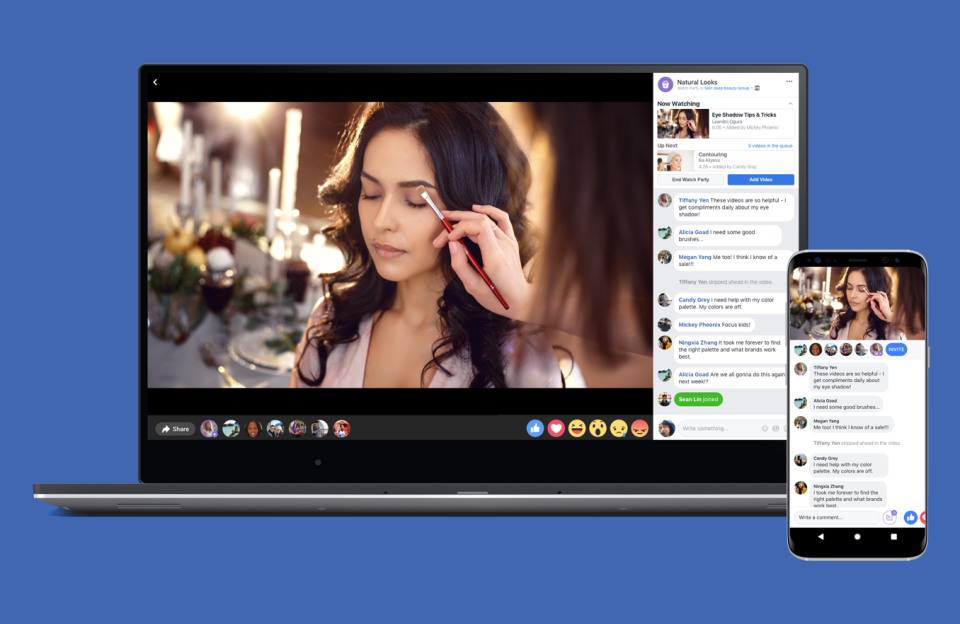

  <h1 style="color: black; padding-bottom: 30px;">Document Tècnic de Teamflick</h1>

  
Membres del grup:

  <ol style="color: black; display: inline-block; text-align: left;">
    <li style="margin-bottom: 10px;"><a href="#" style="color: black; text-decoration: none;">Sara Bogdan</a></li>
    <li style="margin-bottom: 10px;"><a href="#" style="color: black; text-decoration: none;">Sergio Bertomeu Mari</a></li>
    <li><a href="#" style="color: black; text-decoration: none;">Norbert Falcó Ventura</a></li>
  </ol>

***  <!-- o ___ -->

  <h1 style="color: black; padding-bottom: 30px;">Índex</h1>

  <ol style="color: black; display: inline-block; text-align: left;">
    <li style="margin-bottom: 10px;"><a href="#section1" style="color: black; text-decoration: none;">Descripció del projecte</a></li>
    <li style="margin-bottom: 10px;"><a href="#section2" style="color: black; text-decoration: none;">Desenvolupació tècnica</a></li>
    <li style="margin-bottom: 10px;"><a href="#section3" style="color: black; text-decoration: none;">Arquitectura del sistema</a></li>
    <li style="margin-bottom: 10px;"><a href="#section4" style="color: black; text-decoration: none;">Funcionalitats principals</a></li>
    <li style="margin-bottom: 10px;"><a href="#section5" style="color: black; text-decoration: none;">Interacció de l'Usuari</a></li>
  </ol>

***  <!-- o ___ -->

  <h1 style="color: black; padding-bottom: 30px;">Introducció</h1>

  
Teamflick va ser concebut com un servei de "streaming" de pel·lícules i documentals on l'usuari té la capacitat de crear o unir-se a "chat rooms" per organitzar "watch parties". En aquestes sessions, els participants poden veure qualsevol pel·lícula o documental alhora que interactuen entre ells. La idea va ser principalment inspirada pels proveïdors líders d'aquests serveis, com Netflix, Disney+, Amazon Prime, però volíem donar-li una singularitat al nostre projecte que el distingís dels altres serveis més coneguts i ens proporcionés una oportunitat per experimentar amb aquesta fórmula.

***  <!-- o ___ -->

  <h1 style="color: black; padding-bottom: 30px;">Descripció del projecte</h1>

  <ol style="color: black; display: inline-block; text-align: left;">
    <li style="margin-bottom: 10px;"><a href="#section1" style="color: black; text-decoration: none;">1. Anàlisi de mercat - Exploració de tendències de la indústria i competència.</a></li>
    <li style="margin-bottom: 10px;"><a href="#section2" style="color: black; text-decoration: none;">2. Audiència Objectiu - Definició de persones objectiu i preferències.</a></li>
    <li style="margin-bottom: 10px;"><a href="#section3" style="color: black; text-decoration: none;">3. Disseny i Experiència d'Usuari - Creació d'una interfície intuïtiva i amigable per a l'usuari.</a></li>
  </ol>

  <h1 style="color: black; padding-bottom: 30px;">1. Anàlisi de mercat - Exploració de tendències de la indústria i competència</h1>

  
En aquesta secció, examinarem el panorama actual dels serveis de streaming i explorarem les tendències de la indústria, incloent-hi algunes de les principals plataformes com Netflix, Amazon Prime Video, Disney+, i HBO.

  
Malgrat algunes fluctuacions en el nombre de subscripcions als serveis de streaming, és evident que aquesta forma de consumir contingut s'ha convertit en una part integral de la vida quotidiana. Tot i que Amazon no divulga les xifres específiques dels subscriptors de Prime Video, l'increment constant en el nombre de membres de Amazon Prime és un indicador de la continuada popularitat del servei.

  
És rellevant destacar que, tot i una lleugera disminució en algunes subscripcions, la magnitud global d'aquestes plataformes reflecteix la prevalença dels serveis de streaming en la vida diària. Aquest context destaca la importància del projecte Teamflick en un entorn on les persones estan acostumades i involucrades amb el consum de contingut en streaming.

  
Per a Teamflick, aquest anàlisi proporciona una base per comprendre les dinàmiques del mercat i identificar oportunitats per oferir una experiència única i innovadora en el món del streaming de contingut.

  <h1 style="color: black; padding-bottom: 30px;">2. Audiència Objectiu - Definició de persones objectiu i preferències</h1>

  
En aquesta secció, analitzarem l'audiència objectiu de Teamflick, definint clarament les característiques demogràfiques i les preferències dels usuaris a qui volem dirigir-nos.

  
L'audiència objectiu de Teamflick està centrada en aquelles persones que gaudeixen de la interacció social mentre consumeixen contingut en streaming. Això pot incloure amics que vulguin organitzar sessions de "watch party" en línia, famílies que vulguin veure pel·lícules juntes, o individus que busquin una experiència de visualització més col·laborativa.

  
Aquesta definició d'audiència ens guiarà en el desenvolupament de característiques i funcionalitats específiques que satisfacin les necessitats i preferències d'aquests usuaris. La comprensió clara de l'audiència també facilitarà les campanyes de màrqueting i posicionament del producte.

  <h1 style="color: black; padding-bottom: 30px;">3. Disseny i Experiència d'Usuari - Creació d'una interfície intuïtiva i amigable per a l'usuari</h1>

  
Aquesta secció se centra en com Teamflick aborda el disseny de la interfície de l'usuari (UI) i l'experiència d'usuari (UX) per proporcionar una plataforma intuitiva i amigable.

  
La interfície de l'usuari de Teamflick ha estat dissenyada amb un enfocament minimalista i fàcil d'utilitzar. Els elements de navegació són clars i les funcionalitats principals es presenten de manera accessible. A més, s'han tingut en compte els principis de disseny responsiu per garantir una experiència coherent en diferents dispositius.

  
L'experiència d'usuari també es millora mitjançant funcionalitats com ara la personalització dels perfils, suggeriments de contingut basats en preferències i eines interactives per a la gestió de sessions de "watch party". Aquests elements contribueixen a una experiència d'usuari enriquidora i satisfactòria.

***  <!-- o ___ -->

  <h2 style="color: black; padding-bottom: 30px;">Desenvolupació tècnica</h2>

  <ol style="color: black; display: inline-block; text-align: left;">
    <li style="margin-bottom: 10px;"><a href="#section1" style="color: black; text-decoration: none;">Desenvolupació tècnica</a></li>
    <li style="margin-bottom: 10px;"><a href="#section2" style="color: black; text-decoration: none;">Arquitectura del sistema</a></li>
    <li style="margin-bottom: 10px;"><a href="#section3" style="color: black; text-decoration: none;">Funcionalitats Principals</a></li>
  </ol>

  <h2 style="color: black; padding-bottom: 30px;">1. Tecnologíes utilitzades</h2>

***  <!-- o ___ -->

<h2 style="color: black; padding-bottom: 30px;">2. Arquitectura del sistema</h2>

<h3 style="color: black; padding-bottom: 15px;">Client (Navegador o Aplicació Mòbil):</h3>
  <ul style="color: black; text-align: left;">
    <li>Els usuaris utilitzen el client per explorar el catàleg de continguts, seleccionar pel·lícules i iniciar la reproducció.</li>
    <li>L'aplicació té una interfície fàcil d'utilitzar que permet una experiència d'usuari àgil.</li>
  </ul>

<h3 style="color: black; padding-bottom: 15px;">Servidor:</h3>
  <ul style="color: black; text-align: left;">
    <li>Els servidors gestionen diferents funcions, com la gestió d'usuaris, catàleg de pel·lícules, i la transmissió de contingut multimèdia.</li>
    <li>Els servidors emmagatzemen les dades d'usuari, com la informació d'autenticació, historial de visualització i preferències.</li>
  </ul>

<h3 style="color: black; padding-bottom: 15px;">Catàleg de Pel·lícules:</h3>
  <ul style="color: black; text-align: left;">
    <li>El catàleg de pel·lícules es troba al servidor i conté informació sobre totes les pel·lícules disponibles. Aquesta informació es presenta al client a través d'APIs o serveis web.</li>
  </ul>

  
  
*Aquesta imatge representa una possible interpretació aproximada en forma d'esquema de com podria funcionar el nostre projecte i la interacció entre "client", "web app" i "servidor"

<h3 style="color: black; padding-bottom: 15px;">Reproducció de Contingut:</h3>
  <ul style="color: black; text-align: left;">
    <li>Quan un usuari selecciona una pel·lícula, el servidor envia la informació sobre la pel·lícula i gestiona la transmissió del contingut multimèdia (streaming). Utilitza serveis de CDN per assegurar una entrega eficient del contingut als clients.</li>
  </ul>

<h3 style="color: black; padding-bottom: 15px;">Gestió d'Usuaris:</h3>
  <ul style="color: black; text-align: left;">
    <li>El servidor gestiona el registre d'usuaris, autenticació i control d'accés. Utilitza protocols segurs com HTTPS per assegurar la transferència segura d'informació.</li>
  </ul>

<h3 style="color: black; padding-bottom: 15px;">Servidor de Xat:</h3>
  <ul style="color: black; text-align: left;">
    <li>Un nou servei de xat gestionarà la creació i gestió de "chatrooms" associades a pel·lícules específiques. Aquest servei permetrà als usuaris comunicar-se en temps real durant les watch parties.</li>
  </ul>

<h3 style="color: black; padding-bottom: 15px;">Integració amb el Catàleg de Pel·lícules:</h3>
  <ul style="color: black; text-align: left;">
    <li>El servei de catàleg de pel·lícules es pot estendre per incloure informació sobre les watch parties associades a cada pel·lícula. Això pot ser aconseguit mitjançant l'ús d'APIs o altres formes de comunicació entre els serveis.</li>
  </ul>

<h3 style="color: black; padding-bottom: 15px;">Interacció del Client:</h3>
  <ul style="color: black; text-align: left;">
    <li>El client (navegador o aplicació mòbil) mostrarà noves opcions que permetran als usuaris unir-se a watch parties i interactuar en els chatrooms. Potser hi haurà botons com "Crear Watch Party" o "Unir-se al Xat" en les pàgines de detalls de les pel·lícules.</li>
  </ul>

<h3 style="color: black; padding-bottom: 15px;">Fluxe del Sistema per a Watch Parties:</h3>
  <ul style="color: black; text-align: left;">
    <li>Un usuari pot iniciar una watch party, seleccionant una pel·lícula i creant una sala de xat associada. Altres usuaris poden unir-se a la watch party mitjançant la interfície del client. La informació de la watch party es manté sincronitzada entre tots els participants mitjançant el servidor de xat.</li>
  </ul>

  
  
*Una aproximació d'una watch party al nostre projecte

<h3 style="color: black; padding-bottom: 15px;">Persistència de Dades:</h3>
  <ul style="color: black; text-align: left;">
    <li>Les dades relacionades amb les watch parties, com la llista d'usuaris que hi participen i la seva activitat de xat, es poden emmagatzemar de manera persistent per garantir la continuïtat d'una watch party.</li>
  </ul>

***  <!-- o ___ -->

  <h2 style="color: black; padding-bottom: 30px;">3. Funcionalitats Principals</h2>

<h3 style="color: black; padding-bottom: 30px;"><u>Streaming de Contingut</u></h3>

 Descripció de com s'implementa i gestiona el 
    streaming de pel·lícules i sèries.

<h3 style="color: black; padding-bottom: 15px;">Pujada de Contingut:</h3>
  
Pujem el contingut a un sistema d’emmagatzematge extern (Degoo). 
    Obtenim l’enllaç de referència i emmagatzemem a la nostra base de dades (Oracle) referències a l’enllaç dels arxius. 
    També utilitzem metadades com gènere, durada, actors... per tindre més informació.

<h3 style="color: black; padding-bottom: 15px;">Gestió de Bases de Dades i Metadades:</h3>
  
La base de dades ens permet emmagatzemar i gestionar informació 
    (amb l’sql) sobre les pel·lícules de manera estructurada i el sistema d’emmagatzematge extern ens permet tindre les 
    pel·lícules allotjades a algun lloc i poder transmetre-les.

<h3 style="color: black; padding-bottom: 15px;">Processament de Video:</h3>
  
Abans de retransmetre, les pel·lícules passen per un procés de 
    compressió i codificació. Això implica utilitzar algoritmes avançats, en el nostre cas VP9 per reduïr el tamany 
    dels arxius sense sacrificar la qualitat. Ajustem els paràmetres segons les necessitats específiques de cada 
    contingut per assegurar-nos que es transmeti amb eficàcia.

<h3 style="color: black; padding-bottom: 15px;">Protocols de Streaming:</h3>
  
Els protocols de streaming són essencials per garantir una transmissió 
    fluïda i adaptable a les diverses condicions de xarxa. Fem servir MPEG-DASH (dynamic adaptive streaming over HTTP).

<h3 style="color: black; padding-bottom: 15px;"><u>Tecnologies utilitzades per a l'emmagatzematge i transmissió de contingut multimèdia</u></h3>

<h4 style="color: black; padding-bottom: 15px;">Degoo - Servei d’emmagatzematge al núvol:</h4>
  
Ens ofereix:

  <ul style="color: black; text-align: left;">
    <li>Gran capacitat d’emmagatzematge gratuït</li>
    <li>Funcions automàtiques de còpia de seguretat</li>
    <li>Encriptació d’extrem a extrem per garantir la privacitat i seguretat dels nostres arxius</li>
    <li>Compatibilitat multiplataforma</li>
    <li>Funcions de compartir arxius</li>
    <li>Funcions de recuperació d’arxius eliminats</li>
    <li>Compatibilitat amb multimedia</li>
    <li>Actualitzacions automàtiques</li>
  </ul>

<h4 style="color: black; padding-bottom: 15px;">Oracle SQL:</h4>
  
Oracle Structured Query Language és un llenguatge de programació utilitzat per gestionar dades emmagatzemades a la nostra base de dades Oracle. Per exemple per inserir, actualitzar, eliminar i recuperar dades de manera eficient. És part integral del sistema de gestió de base de dades relacional Oracle Database.

  
Algunes característiques:

  <ul style="color: black; text-align: left;">
    <li>Potent capacitat de consulta</li>
    <li>Fàcil d’aprendre i utilitzar</li>
    <li>Consistència i integritat de dades</li>
    <li>Suport per a transaccions</li>
    <li>Seguretat de dades</li>
    <li>Flexibilitat en la recuperació de dades</li>
  </ul>

<h4 style="color: black; padding-bottom: 15px;">Oracle:</h4>
  
Es tracta d’un sistema de gestió de base de dades relacional ampliament utilitzat en entorns empresarials. És conegut per ser robust, escalabilitat i capacitat de gestionar grans conjunts de dades. Oracle utilitza el llenguatge de programació SQL per interactuar amb la base de dades.

  
Alguns beneficis:

  <ul style="color: black; text-align: left;">
    <li>Escalabilitat</li>
    <li>Rendiment optimitzat</li>
    <li>Seguretat integral</li>
    <li>Suport per dades no estructurades</li>
    <li>Conformitat amb ACID</li>
  </ul>

<h4 style="color: black; padding-bottom: 15px;">VP9:</h4>
  
És un còdec de video d’alta eficiència. Amb l’objectiu principal d’oferir alta qualitat de compressió de video, permetint la transmissió i reproducció eficient de contingut multimèdia en línia. Osigue és una eina que ajuda a fer videos més petits sense perdre molta qualitat.

  
Beneficis:

  <ul style="color: black; text-align: left;">
    <li>Eficiència de compressió significativament millorada</li>
    <li>Resolucions altes i taxes baixes de bits</li>
    <li>Codi obert i gratuït</li>
    <li>Adaptabilitat a diferents amplades de banda</li>
    <li>Suport per a HDR</li>
  </ul>
  
Explicació detallada:

  <ul style="color: black; text-align: left;">
    <li>Codificació (Compressió): redueix la mida de l’arxiu original per facilitar l’emmagatzematge, la transmissió o el processament.</li>
    <li>Decodificació (Descompressió): procés invers de la codificació.</li>
    <li>Tipus de còdecs:</li>
    <ul>
      <li>D’audio: MP3, AAC, FLAC</li>
      <li>De video: H.264, H.265 (HEVC), VP9</li>
    </ul>
    <li>Són fundamentals per la transmissió eficient de dades multimèdia a través de la web, ja que redueixen els requisits d’ample de banda.</li>
  </ul>

<h4 style="color: black; padding-bottom: 15px;">MPEG-DASH (Dinàmic Adaptive Streaming over HTTP):</h4>
  
És un estàndard obert basat en HTTP dissenyat per a la transmissió adaptativa de contingut multimèdia, com ara vídeos en línia. Proporciona una manera eficient de transmetre contingut multimèdia a través d'Internet. La seva principal característica és la transmissió adaptativa, el que significa que s'ajusta dinàmicament a les condicions de xarxa i les capacitats del dispositiu de l'usuari per oferir una experiència de reproducció contínua i d'alta qualitat.

  
Alguns beneficis:

  <ul style="color: black; text-align: left;">
    <li>Permet l’adaptació dinàmica de la qualitat de video segons la condició de la xarxa</li>
    <li>Suport per múltiples dispositius</li>
    <li>És adequat tant per la transmissió de contingut en directe com per la contribució de contingut baix demanda</li>
    <li>Facilitat d’implementació</li>
  </ul>

<h3 style="color: black; padding-bottom: 15px;"><u>Interacció de l'Usuari</u></h3>

<h4 style="color: black; padding-bottom: 15px;">Funcionalitats relacionades amb la interacció de l'usuari</h4>
  
(per exemple, creació de comptes, perfils, configuracions de control parental).

<h4 style="color: black; padding-bottom: 15px;">Creació de Comptes:</h4>
  
Molt senzill per a l’usuari ja que el que fa és introduïr algunes poques dades, es crea el seu compte, i ja pot iniciar sessió. El que fem és que una vegada l’usuari introdueix les dades requerides, es verifiquen automàticament i s’emmagatzemen a la nostra base de dades dels nostres usuaris. D’aquesta manera es guarden totes les dades i es pot iniciar sessió. Utilitzem com a base de dades l’Oracle SQL, amb la taula d’usuaris.

<h4 style="color: black; padding-bottom: 15px;">Perfils:</h4>
  
El teu perfil pot estar a 3 nivells que hem creat, depenent del plà de pagament que hauràs elegit. Per exemple, tenim el nivell 1 (premium), nivell 2 (estàndar), i el nivell 3 (estàndar amb anuncis). On tindràs més beneficis si ets nivell més alt, encara que les funcionalitats que es permeten a l’usuari ja les hem concretat a la nostra pàgina a la secció de preus.

  
Al backend (servidor) verificarem els permisos de l’usuari i permetem o deneguem accions segons el nivell. Després això ho rep el client (frontend), on utilitzem JavaScript per adaptar l’interfície de l’usuari segons els seus permisos.

<h4 style="color: black; padding-bottom: 15px;">Implementació de Control Parental:</h4>
  
A la nostra configuració a la plataforma tenim una opció que és el control parental. Una vegada es selecciona, es restringeix cert contingut de la plataforma, ja que per a les pel·lícules també tenim un camp on posem l’edat que recomanem per veure-la. Si la funció de control parental s’habilita, les pel·lícules de +16 es restringeixen i el xat també, deixant solament les reaccions amb els emojis.

  
Si l’usuari intenta veure una peli amb la classificació d’edat superior a la configurada pel control parental (+16), verifica la configuració, i si està activada, denega l’accés mostrant un missatge de restricció. Quant al xat, no es mostra visible, solament el lloc de les reaccions amb emojis.

<h3 style="color: black; padding-bottom: 15px;"><u>Backend (Costat del Servidor)</u></h3>

Lògica de negoci per verificar la classificació d'edat i la configuració del control parental.

Preneu decisions basades en la configuració per denegar l'accés o permetre'l.

Proporciona missatges de restricció en cas de denegar l'accés.

Interactua amb la base de dades per obtenir informació sobre la classificació d'edat de la pel·lícula i la configuració del control parental.

<h3 style="color: black; padding-bottom: 15px;"><u>Frontend (Costat del Client)</u></h3>

Presenta la interfície d'usuari on l'usuari intenta veure una pel·lícula.

Realitza sol·licituds al backend per verificar la classificació d'edat i la configuració del control parental.

Mostra missatges de restricció o actualitza la interfície segons la resposta del backend.

Controla la visibilitat del xat, mostrant només el lloc de les reaccions amb emojis segons la configuració del control parental.

<h3 style="color: black; padding-bottom: 15px;"><u>Eines de Comunicació i Participació de l'Usuari</u></h3>

(xat en temps real, comentaris, valoracions).

<h4 style="color: black; padding-bottom: 15px;">Xat en Temps Real</h4>

Es basa en arquitectures de comunicació bidireccional i tecnologies que permeten la transmissió instantània de missatges entre usuaris.

<u>Protocol WebSocket</u>

La majoria de chats en temps real utilitzem el protocol WebSocket. Proporciona una connexió persistent i bidireccional entre el client (navegador de l’usuari) i el servidor. A diferència de HTTP, que és de solicitud-resposta, WebSocket permet la comunicació en temps real.

<u>Connexió</u>

Quan un usuari accedeix al xat, s’estableix una connexió WebSocket entre el client i el servidor. Aquesta connexió es manté oberta per permetre la transmissió bidireccional de dades.

Comentaris -

<ul style="color: black; text-align: left;">
  <li>Utilitzem la base de dades on emmagatzemar els comentaris amb una taula específica.</li>
  <li>Implementem lògica al backend per gestionar la creació, lectura, actualització i eliminació amb Python (amb Flask).</li>
  <li>També implementem la lògica al front-end on es veurien els comentaris.</li>
  <li>També tenim moderació de comentaris, on els nostres treballadors moderen manualment.</li>
</ul>

Valoracions -

<ul style="color: black; text-align: left;">
  <li><strong>Front-end:</strong> Afegir secció de valoracions a la interfície d'usuari.</li>
  <li><strong>Crear un sistema d'estrelles interactiu:</strong> Perquè els usuaris assignin les seves valoracions.</li>
</ul>

<strong>Base de dades:</strong> Utilitzar la base de dades per emmagatzemar les valoracions associades a cada pel·lícula.

<strong>Interactivitat:</strong>

<ul style="color: black; text-align: left;">
  <li>Implementar la lògica perquè les estrelles responguin als clics dels usuaris.</li>
  <li>Enviar les valoracions al servidor per al seu processament i emmagatzematge.</li>
</ul>

***  <!-- o ___ -->

